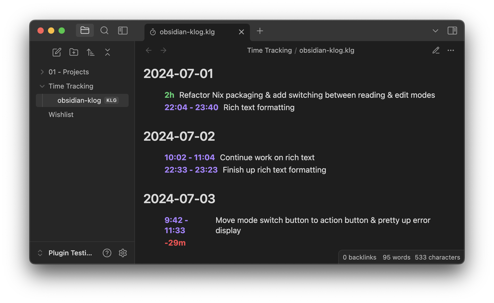

# Klog Obsidian Plugin

An [Obsidian](https://obsidian.md) plugin adding support for the
[Klog](https://klog.jotaen.net/) plaintext time-tracking file format.

## Installation

This plugin is not yet submitted to the community plugins repository, so you
will need to manually install by grabbing the
[latest release](https://github.com/ovyerus/obsidian-klog/releases/latest) and
placing the files into `<vault>/.obsidian/plugins/obsidian-klog`, or by checking
out the repository in the same location and building it.

## Roadmap

- [ ] Text formatting/Rich text previews.
  - Requires a JS parser for the format.
- [ ] Beyond plain text editing.
- [ ] Make Obsidian aware of Klog tags.
- [ ] Command palette integration.
- [ ] Try do some cool stuff with time summaries/previews.
- [ ] Possibly add a Dataview integration?
